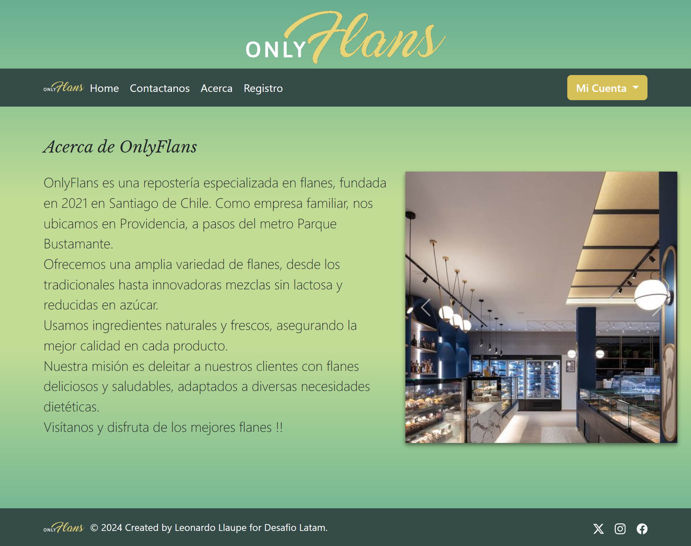
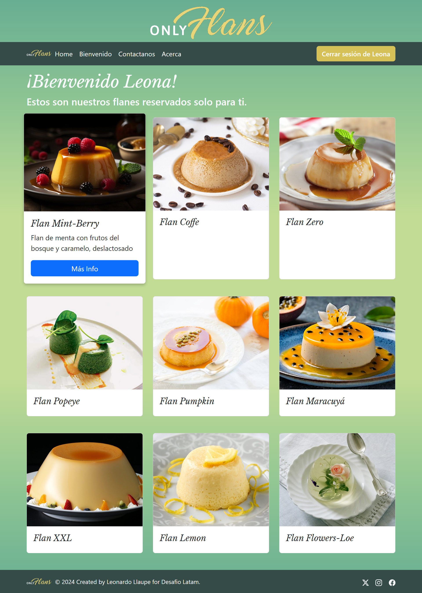

# 
 "OnlyFlans" 

 APLICACION WEB DE CATALOGO PUBLICO Y PRIVADO DE IMAGENES DE FLANES
      

  
  
# Stack  
HTML, CSS, JavaScript, Bootstrap, Python, Django, SQLite 

# Algunas sugerencias de instalación

REQUIREMENTS:  
Para instalar todos los paquetes listados en requirements-env_onlyflans.txt usar:  
pip install -r requirements-env_onlyflans.txt               

BASE DE DATOS:  
Por defecto Django ya trae configurada la base de datos con SQLite  
Es necesario poblar base de datos del modelo Flan a traves de la vista Django admin o insercion de datos con comandos SQL, el formato de las imagenes deben ser urls de imagenes de internet
  
# Algunos Screenshots  

  

Indice  
    
Acerca  
    
Registro  
    
Bienvenido (vista privada)  
        
Contacto
  

  

